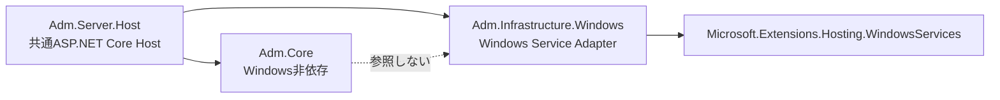

# AI Development Manager 統合基本設計書

版: 1.3-p0-008-atomic-save
状態: P0-008完了
基準日: 2026-08-02

## 1. 目的と対象

AI Development Managerは、LAN内の人とAIがソフトウェア開発資料を同じ根拠に基づいて閲覧、記録、検索、再利用するための開発支援システムである。

MVPでは、既存の`ticket`フォルダーを壊さずに読み込み、チケット閲覧、添付閲覧、テスト実施、結果保存、LAN共有、キーワード検索、AI向けコンテキスト出力までを一連の流れとして成立させる。

Penguin Hub、Penguin OS、意味検索、AIチャット、自動実装、汎用プラグインは対象外とする。

## 2. 設計原則

1. Markdownと添付ファイルを業務データの正本とする。
2. Front Matterがない既存Markdownを読み込めることを必須とする。
3. 既存Markdownへ分類結果や確認状態を無断で書き戻さない。
4. 業務データの読取・更新はServer APIを経由する。
5. WPFとブラウザで同じWeb UI、同じAPI契約を利用する。
6. LAN内でも認証とHTTPSを省略しない。
7. AIクライアントは標準で読み取り専用とする。
8. 保存前バックアップ、競合検知、原子的保存を行う。
9. SQLiteは削除後に正本から再構築できるキャッシュとする。
10. UIはVol.5のガードレールを拘束条件とする。
11. 不明な仕様は推測で確定せず、未決事項として管理する。

## 3.3 文書種別自動判別

Front Matterの`document_type`を最優先し、存在しない場合は、ファイル名、フォルダー、見出し、表構造の順にルール判定する。判定結果には種別、信頼度、根拠コードを保持する。競合または判定不能は`unknown`とし、原本Markdownへ結果を書き戻さない。手動分類は自動判定結果とは別のオーバーレイとして扱う。

## 3.4 `.adm-meta`サイドカー

既存Markdownは変更せず、プロジェクトメタデータを`.adm-meta/project.json`、文書メタデータを`.adm-meta/documents/<ULID>.json`、利用者固有の確認状態と手動分類を`.adm-meta/users/<user>/documents/<ULID>.json`へ分離して保存する。ULIDは不変文書ID、連番は文書種別ごとの人向け番号とし、採番は排他ロックと同一ディレクトリ内の原子的置換で保護する。改名候補は内容SHA-256等で提示するが、曖昧な一致を自動確定しない。

## 3.5 NTFS原子的保存

原本と同一ディレクトリの一時ファイルへ書込み、Flush後に保存前バックアップを作成し、置換する。成功時は新内容、失敗時は原本またはバックアップと入力内容を回復可能な状態で残し、孤立一時ファイルを安全な接頭辞と経過時間で清掃する。読み取り専用属性は置換前に一時解除し、成功・失敗後に復元する。ACLの保持・継承は製品採用前にWindows実機で確定する。

## 3. 論理構成

### 3.1 AI Development Manager Server

責務:

- HTTPSエンドポイントとREST API
- 認証、認可、APIトークン
- プロジェクト登録と安全なパス検証
- Markdown・Front Matterの解析
- 文書種別判別と手動分類の適用
- チケット、テスト、添付の取得と更新
- ETagによる競合検知
- 原子的保存と保存前バックアップ
- ファイル監視、定期再走査、手動再走査
- SQLite索引キャッシュの作成と再構築
- 監査ログ
- AI向けコンテキスト生成

ServerはWPFとは別プロセスとし、WPF終了後もLANブラウザから利用できる構成にする。

正式運用ではWindows Serviceとして起動する。同じServer Hostを、開発・デバッグ用コンソール、管理者による手動起動、必要に応じたトレイ起動からも利用できるようにし、起動方式ごとに業務ロジックを複製しない。

Serverの業務ロジック、API、Web UIはWindows固有処理へ直接依存させない。Windows Service制御、Firewall、証明書ストアなどはWindows Adapterへ隔離する。

P0-002のPoCで次の配置境界を確認した。



コンソール、Windows Service相当、手動、トレイの4用途は、`Adm.Server.Host`の同一Host生成処理を再利用する。起動用途の差はAdapter設定に限定し、業務ロジックの起動方式別分岐を設けない。正式Service登録、トレイUI、インストーラーは後続の製品実装で扱う。

### 3.2 共通Web UI

責務:

- プロジェクト、チケット、テスト、資料、検索、設定画面
- 保存状態、通信状態、競合、権限不足の可視化
- ライト・ダークテーマ
- 狭幅、標準幅、広幅への対応
- キーボード操作とアクセシビリティ
- WebView2とEdge／Chromeで同等の主要操作を提供

React＋TypeScriptを第一候補とし、Phase 0 PoCで正式採用を判断する。

### 3.3 WPF Client

責務:

- 共通Web UIをWebView2で表示
- Serverの起動状態と接続状態の案内
- Windowsファイル／フォルダー選択
- 元フォルダーを開く
- OS通知
- WebView2 Runtimeの存在確認と案内

WPFブリッジからMarkdownや添付を直接更新してはならない。業務データ操作は必ずAPIを経由する。

### 3.4 通常ブラウザ

ブラウザでは次を提供する。

- パスの表示とコピー
- Server経由の閲覧、プレビュー、ダウンロード
- チケット・テスト結果の許可された更新

Server PCのExplorerを開く操作や、クライアントPCからServerのローカルフォルダーを直接開く操作は提供しない。

### 3.5 AIクライアント

- HTTPS REST APIを利用する。
- 標準トークンは読み取り専用とする。
- トークンには利用者、対象プロジェクト、許可操作、有効期限を持たせる。
- 書き込み権限は明示的に発行し、保存前バックアップと監査ログを必須とする。
- AI Workbench固有機能がなくても、コンテキストのファイル出力とAPI取得を利用できる。

## 4. 保存領域

### 4.1 プロジェクト領域

MVPではServer PC上のローカルNTFSのみを正式対応する。

```text
<project-root>/
  ticket/
    ...既存Markdownと添付...
  .adm-meta/
    project.json
    documents/
    users/
    audit/
```

`.adm-meta`はAI Development Managerが管理する補助正本であり、SQLiteキャッシュとは区別する。

- `documents/`: 既存文書の不変ULID、手動分類、相対パス、識別用指紋
- `users/`: 利用者ごとの確認状態など、プロジェクト内のユーザー固有情報
- `audit/`: プロジェクト文書に対する変更記録

ユーザーのパスワードやServer秘密情報はプロジェクト内へ保存しない。

### 4.2 Server構成領域

Server PCのアプリケーションデータ領域に、次を原子的に保存する。

- Server設定
- 登録プロジェクト一覧
- ユーザーとロール
- パスワードハッシュ
- APIトークンのハッシュと権限
- 証明書参照情報
- 管理監査ログ

秘密値は平文で保存せず、Windowsの保護機構を利用する。SQLiteをこれらの唯一の正本にはしない。

### 4.3 SQLite索引キャッシュ

SQLiteには次だけを保持する。

- 文書パスと識別子
- Front Matter抽出値
- 見出しと本文検索テキスト
- 文書種別、状態、関連ID
- 添付の索引情報
- 走査状態と解析エラーのキャッシュ

SQLiteを削除しても、Markdown、添付、`.adm-meta`、Server構成正本から再構築できなければならない。

## 5. Markdownと識別子

### 5.1 新規文書

新規文書には次を持たせる。

- `document_id`: 不変ULID
- 種別別ID: `TK-000001`、`TC-000001`、`TR-000001`など
- `schema_version`
- `document_type`
- 作成・更新情報

人向け連番は表示、会話、ファイル名に使用できる。不変ULIDは参照整合性と改名耐性に使用する。

### 5.2 既存文書

Front Matterがない文書は、次の順で判別する。

1. Front Matter
2. ファイル名
3. 保存フォルダー
4. 見出しと表構造
5. 判別不能

判別結果の信頼度と根拠を保持する。自動判別結果はMarkdownへ書き戻さず、手動分類は`.adm-meta`へ保存する。

既存文書へ初めて不変ULIDを割り当てる場合も、ULIDは`.adm-meta`へ保存する。外部改名後の追跡は相対パス、内容指紋、ファイル属性を組み合わせ、曖昧な場合は自動確定しない。

### 5.3 文書種別

MVP標準:

- `ticket`
- `test_case`
- `test_result`
- `design`
- `adr`
- `knowledge`
- `activity_log`
- `unknown`

`architecture`、`roadmap`、`changelog`、`release_note`は将来予約種別とする。

### 5.4 検証コーパス

P0-004の入力契約は`../poc/fixtures/manifest.yaml`とする。fixtureは実データを含まない合成Markdownで、正常系と異常系を分離し、各入力へ期待文書種別、警告、抽出値、SHA-256、文字コードを紐付ける。解析PoCは入力を書き換えず、manifestのハッシュ一致を開始条件とする。Front Matterなし、壊れたYAML、未知キー、旧schema、表列の不足・追加・巨大セル、UTF-8 BOM、Shift_JIS、欠落添付、登録ルート外の相対パスを最低限の異常系として扱う。

P0-005で確定した解析契約は`07_MARKDOWN_PARSING_CONTRACT.md`を正とする。本文、見出し、表、添付参照、Front Matter抽出を段階的に行い、警告と致命的エラーを文書単位で分離する。入力は変更せず、巨大セルの正式上限は後続PoCで確定する。

## 6. Ticket、TestCase、TestResult

### 6.1 Ticket

チケットの進行状態と、利用者ごとの確認状態を別に管理する。

- 進行状態: 文書の共有業務状態
- 確認状態: 利用者単位の既読・確認済み情報

既存チケットの進行状態を変更する方法は、文書が管理対象として明示的に編集可能な場合だけFront Matter更新を許可する。既存原本を変更しない運用では、状態も`.adm-meta`のオーバーレイとして管理する。

### 6.2 TestCase

テストケースは実施内容と期待結果を定義し、実施結果を含めない。同一ケースを複数回、複数環境で利用できる。

### 6.3 TestResult

1回の実施を1つの`execution_id`で識別する。結果文書はテストケースと別Markdownにする。

最低項目:

- 不変ULID
- 人向け`test_result_id`
- `test_case_id`
- `execution_id`
- 実施日時、実施者、環境
- 各`item_id`の判定、備考、添付
- 保存時の版情報

判定表示:

| 内部値 | 表示 |
|---|---|
| `passed` | ○ 問題なし |
| `warning` | △ 動いたが気になる |
| `failed` | × 正しく動かない |
| `not_tested` | － まだ試していない |
| `blocked` | ほかの問題で試せない |

## 7. API方針

- ベースパスは`/api/v1`とする。
- OpenAPIを契約正本とする。
- 一覧APIはページング、並べ替え、絞り込みを持つ。
- 更新APIは`If-Match`を必須とする。
- 競合はHTTP 409とし、保存対象、クライアント版、Server最新版、差分取得先を返す。
- 認証失敗と権限不足を区別する。
- エラー応答は内部例外を露出せず、「何が起きたか」「入力が残っているか」「次の行動」「追跡ID」を返す。
- 添付配信はContent-Type、Content-Disposition、Range、容量制限をServer側で制御する。
- 大容量アップロードは進捗率、取消、失敗理由、同じ入力からの再試行を提供する。
- 取消または失敗した一時アップロードを業務データとして確定せず、期限付きで安全に清掃する。
- APIの破壊的変更時はバージョンを上げる。

主要API群:

- `/auth`
- `/projects`
- `/documents`
- `/tickets`
- `/test-cases`
- `/test-executions`
- `/attachments`
- `/search`
- `/context-exports`
- `/backups`
- `/admin`

## 8. 認証と権限

### 8.1 人の利用者

- 初回設定で最初の管理者を作成する。
- ブラウザとWebView2はSecure、HttpOnly、SameSite属性付きセッションCookieを利用する。
- パスワードは適切な反復回数を持つ一方向ハッシュで保存する。
- ログイン試行制限、セッション失効、明示ログアウトを持つ。

### 8.2 ロール

- 管理者: Server設定、プロジェクト登録、ユーザー・トークン管理
- 編集者: テスト結果、備考、添付、許可された状態変更
- 閲覧者: 閲覧、検索、ダウンロード
- AIクライアント: 発行トークンで明示されたAPI権限のみ

MVPではプロジェクト単位のロールを基本とし、文書単位ACLは対象外とする。

## 9. LANとHTTPS

- 初期状態ではlocalhostだけで待ち受ける。
- 初期設定ウィザードで利用するLANアドレスを明示選択する。
- `0.0.0.0`を暗黙に使用しない。
- Server名または固定アドレスを証明書SANへ含める。
- ウィザードでローカル認証局、Server証明書、クライアント信頼用証明書を生成する案をPhase 0で検証する。
- 信頼用証明書の導入手順は、画面案内、確認、失敗時の戻し方を含める。
- Windows Firewall規則は対象ポートと実行ファイルに限定し、適用前に確認する。
- LAN外公開、ルーターのポート開放、自動UPnPは行わない。

## 10. 走査、索引、検索

- 初回全走査、FileSystemWatcher、デバウンス、定期再走査、手動再走査を組み合わせる。
- FileSystemWatcherを唯一の正しさの根拠にしない。
- 読取失敗は文書単位で隔離し、全体を停止しない。
- 検索対象はファイル名、Front Matter、見出し、本文、状態、関連IDとする。
- MVPはキーワード、エラーコード、属性絞り込みまでとする。
- 意味検索と類似検索はMVP後とする。

## 11. 同時編集と原子的保存

1. 読込時にETagを返す。
2. 更新時に`If-Match`を検証する。
3. 不一致なら書き込まず409を返す。
4. 内容とパスを検証する。
5. 同一フォルダーの一時ファイルへ書き、Flushする。
6. 保存前バックアップを作成する。
7. NTFS上で原子的に置換する。
8. 監査記録を残す。
9. 索引キャッシュを更新する。失敗時は再走査対象にする。

保存、バックアップ、監査を完全な単一トランザクションにはできないため、処理段階を記録する回復ジャーナルを持ち、再起動時に未完了操作を検出する。

## 12. 添付とZIP

添付は関連文書からの相対パスで参照し、登録ルート外へ出られないことを正規化後の実パスで確認する。

- 画像: PNG、JPEG、WebP、GIFを内蔵表示
- PDF: ブラウザ内蔵表示を基本とし、ダウンロードも提供
- 動画: ブラウザが安全に再生できる形式をRange対応で配信し、非対応形式はダウンロード
- ログ／テキスト: 文字コード、容量、行数を制限して表示
- ZIP: 一覧表示と、許可された個別エントリーの制限付き閲覧

ZIPは一括自動展開しない。Zip Slip、展開後容量、ファイル数、圧縮率、ネスト深度を検査する。

初期制限は、ZIP自体500 MiB、エントリー10,000件、個別展開250 MiB、合計展開見積2 GiB、圧縮率100倍、ネスト2階層とする。管理画面から変更できるが、安全下限・上限と変更監査を持たせる。

## 13. バックアップと復元

- 文書保存前、添付更新前、スキーマ移行前、AI書き込み前にバックアップする。
- 文書と関連添付を同じバックアップ単位として扱う。
- 管理画面から保持日数、世代数、容量上限を変更できる。
- 復元前にも現在状態を退避する。
- 復元はプレビュー、対象確認、実行、検証、索引再構築の順とする。
- Server設定と認証情報はプロジェクトバックアップとは別に保護バックアップする。
- 初期保持は30日、文書ごと最低20世代、全体上限は50 GiBまたは空き容量20%の小さい方とする。
- 容量上限は管理画面から変更可能とし、80%で警告する。
- 大容量添付は内容ハッシュによる重複検知、参照管理、またはファイルシステム機能の利用をPhase 0で比較する。復元可能性と単純性を損なう方式は採用しない。

## 14. DevTicketManager互換

MVPで次を引き継ぐ。

- Markdown一覧と本文表示
- 作成・更新日時
- 名前・日時による並べ替え
- 検索
- 利用者ごとの確認状態
- 元ファイル／フォルダー操作のWPF連携
- プロジェクト切替

移動、改名、Front Matter追加、一括変換は自動で行わない。実データサンプル受領後に互換PoCを行い、読込仕様と例外を確定する。

## 15. UI・UX

- 一画面一責務
- 通常表示に内部ID、API名、DB名を出さない
- 状態は色、文字、アイコンを併用
- 保存中、保存済み、未保存、保存失敗を明示
- 危険操作は対象名を含む確認を行う
- ライト／ダーク、Hover、Pressed、Disabled、Focusを確認
- 100%、125%、150%、200% DPIを確認
- 狭幅でも主要操作を消さない
- テーブルでは主要列と結果列を見失わない

Phase 0で主要画面のワイヤーフレームを作成し、ユーザー承認後に基準スクリーンショットとデザイントークンを確定する。

## 16. テスト方針

- ドメイン・解析・パス検証の単体テスト
- Markdownと`.adm-meta`のゴールデンファイルテスト
- `poc/fixtures/manifest.yaml`に対するfixture存在・SHA-256・期待警告の検証
- NTFSを使用した保存・競合・回復統合テスト
- API契約テスト
- 権限マトリクステスト
- PlaywrightによるブラウザE2E
- WebView2での主要フロー確認
- ライト／ダークとDPIの画面回帰確認
- 1万文書と大容量添付の性能試験
- Zip Slip、パストラバーサル、認可漏れのセキュリティ試験
- バックアップからの復元演習

## 17. 非機能目標

- 正式対応OSはWindows 11 64-bitとする。
- Windows依存はService設定、WPF、Explorer起動、Firewall、証明書設定等のAdapterへ限定する。
- 1プロジェクト1万文書を初期想定とする。
- 同時利用者5名とAIクライアント2接続を初期性能基準とする。
- 初回一覧は標準評価PCで3秒以内を暫定目標とする。
- 索引済み検索の95パーセンタイルは500ms以内を暫定目標とする。
- 走査とサムネイル生成でUIスレッドを塞がない。
- 部分破損でアプリ全体を停止しない。
- 保存失敗時に入力内容を保持する。
- ログへパスワード、トークン本文、不要な個人情報を記録しない。

評価PCと同時利用者数が未確定のため、性能値はPhase 0で補正する。

P0-003で評価PC、クライアント条件、1万文書・添付・同時利用者の基準モデル、p95の計算方法、結果保存場所を確定した。既存の暫定目標である初回一覧p95 3秒以内、索引済み検索p95 500ms以内は、後続PoCの比較基準として扱う。基準環境の.NET SDKが製品計画の.NET 10と異なる場合は、結果へ差異を記録し、同一結果として比較しない。

## 18. MVP完了条件

認証済みの複数利用者がLAN内のWPFと通常ブラウザから同じプロジェクトへ接続し、既存Markdownを閲覧し、テストケースを実施し、添付付き結果を競合なくMarkdownへ保存し、検索とAI向けコンテキスト出力を行い、バックアップから復元できること。
