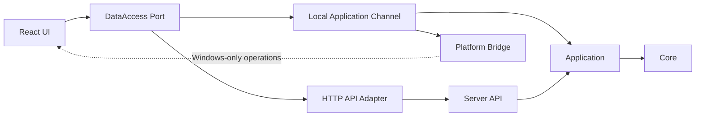
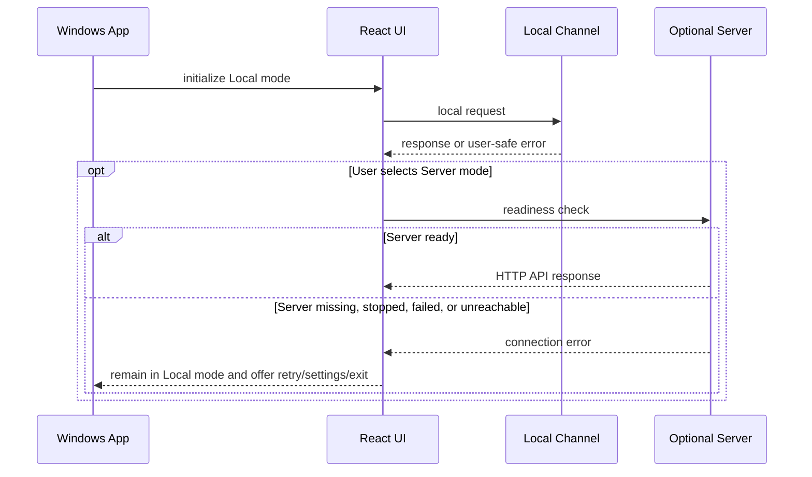

# ADR-019 ローカルファースト実行モデル

## 状態

承認済み（P1-028、2026-08-03）。本ADRはP1-028で確定した設計正本であり、製品コードの変更を伴わない。

## Context

従来のWPF ClientはServerが配信するWeb UIへ接続するClientとして設計されていた。P1-027のWindows 11実機確認では、Server MSIのService起動失敗、Server未接続時の利用不能、接続失敗画面からの退出・設定変更不足が確認された。Windowsアプリを通常利用するために、Serverを必須条件から外す必要がある。

## Decision

Windowsアプリを主製品とし、Server／APIを任意導入の追加機能とする。初回起動時に利用形態を選ばせる必須ウィザードは設けず、既定経路はLocal modeとして直ちにローカルホームを表示する。Server未導入・停止・障害・一時的な接続不能でも、Windowsアプリはローカルホームへ進める。

Server modeは、LAN共有、通常ブラウザ利用、REST API、AI連携、外部接続などが必要な場合にユーザーが選択する追加経路である。Server modeの認証、HTTPS、権限、LAN公開は本ADRで実装せず、既存のServer境界および後続チケットで扱う。

## Architecture

- React UIはHTTP Clientへ直接依存せず、DataAccess Portだけを参照する。
- Local Application ChannelとHTTP API Adapterは同じApplication／Core契約へ収束させ、業務ロジックを複製しない。
- Platform BridgeはWindows固有操作専用とし、業務データ操作を混在させない。
- Local modeではWPFパッケージ内の共通React UIをWebView2へ表示し、Kestrel、localhostポート、HTTP API、隠れたServerプロセスを起動しない。
- Local modeの業務呼出は、WPFプロセス内のLocal Application Channelから同一プロセスのApplication Servicesへ渡す。

## 起動シーケンス

## Local Application Channel minimum contract

Phase 1では次の3種類だけを設計境界とする。

| 種別 | 目的 |
|---|---|
| Request | 操作名と入力をApplication層へ渡す |
| Response | 要求に対応する結果を返す |
| Error | 利用者向け案内と追跡可能な安全な失敗を返す |

Envelopeの具体的なフィールド、型、要求サイズ、同時実行数、取消、進捗、例外マスキング、traceIdの検証規則は後続の契約チケットで確定する。P1-028では契約の存在と責務境界だけを確定し、Progress、Cancel、Streaming、分割転送、双方向イベント、汎用ジョブ、汎用RPC、プラグイン機構は実装しない。

## 起動失敗時の必須導線

Server未導入、停止、起動失敗、接続不能、ネットワーク利用不可のいずれでも、Windowsアプリはローカルホームを維持し、共有機能について次を提供する。

- ローカル利用へ進む
- Server設定を開く
- 再試行する
- アプリを終了する

LAN Server接続を選択する場合、Server URL、認証、HTTPS、権限、証明書の扱いはそれぞれの契約に従う。Local modeへフォールバックする際にServerを自動起動したり、認証を回避したりしない。

## データ所有と競合

同一プロジェクトの書き込み所有者はLocal modeまたはServer modeの一方に限定する。両者が同時にMarkdown、添付、`.adm-meta`、索引、バックアップへ書き込むことを許可しない。実行時所有リースは`.adm-meta`配下に置き、端末、利用者、プロセス、取得時刻、更新時刻を記録する。所有権リース、失効、回復、競合UIの詳細は後続の独立設計で確定するまで、別主体は読み取り専用または書き込み拒否とする。異常終了リースは自動削除せず、安全確認と監査記録を伴って解除する。文書単位のETag競合検知は所有リースとは別に維持する。

Local modeの保存対象は、ユーザーが選択したプロジェクト、ローカル設定、索引、バックアップを含む。ローカル利用者には端末内で安定した利用者ULIDを割り当て、将来Serverへ共有する場合のServerアカウントとの対応付けは明示操作とする。

## 既存設計の扱い

| 既存判断 | P1-028の扱い | 理由 |
|---|---|---|
| WPFはServer配信Web UIのClient | 置換 | Windowsアプリ単体を主製品にするため |
| Serverはlocalhost限定 | 維持 | Server modeの安全境界として維持 |
| Server／Service／MSI | 補足 | 任意導入の追加機能として保持 |
| WPF WebView2と共通Web UI | 補足 | Local／HTTPのDataAccess Portへ接続する前提を追加 |
| WPF Bridge | 維持 | Windows固有操作に限定し、業務Channelと分離 |
| P1-025／P1-027のInstaller実機未完了 | 履歴として保持 | 実機結果を削除せず、Local modeの完了条件から分離 |
| LAN、HTTPS、認証、権限 | 履歴・後続境界として保持 | Local modeへ混入させない |

## Consequences

- Windowsアプリの通常利用にServer、Service、LAN、HTTPS、外部Runtime接続を必須にしない。
- Application層とCoreの再利用が前提になるため、Local／HTTP双方の契約テストが必要になる。
- Server固有のAPI、Service、Installerは任意機能として存続するが、主製品の起動可否を決めない。
- 業務機能、DataAccess Port、Local Application Channel、ローカルホームの実装は本ADRの決定を入力として後続チケットで一件ずつ扱う。初回起動の必須ウィザードや起動時Server検出は採用しない。

## Scope guard

P1-028では`src/`、`tests/`、`installer/`、`poc/`を変更しない。P1-029以降のチケットを作成・実施せず、Server MSI、Service、HTTPS、認証、LAN公開の修正も行わない。
