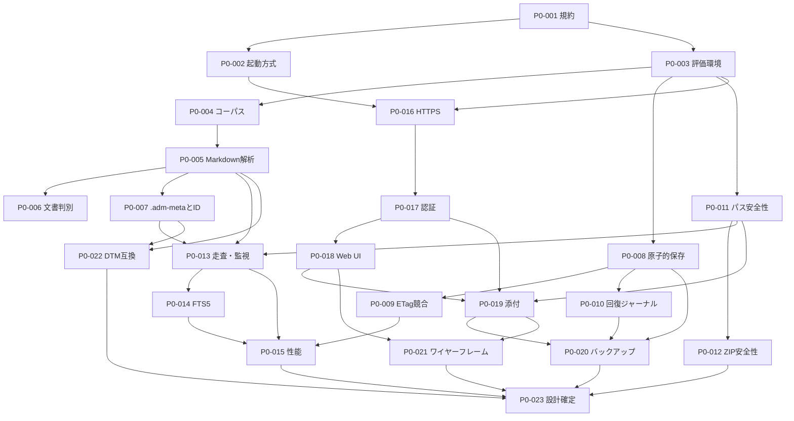

# AI Development Manager Phase 0 詳細チケット一覧

版: 1.9
状態: P0-008完了
対象: Phase 0のみ

## 1. 方針

- 各チケットは単独で実施、レビュー、結果確認、完了判定できる大きさとする。
- PoC成果物は製品コードへ自動的に昇格させない。
- 合格・不合格の双方を記録し、採用判断はADRへ残す。
- UI基盤検証と業務機能実装を混在させない。
- Phase 1以降の機能実装を行わない。

## 2. チケット一覧

| 順序 | 番号 | タイトル | 主な依存 | 状態 |
|---:|---|---|---|---|
| 1 | [P0-001](P0-001_REPOSITORY_RULES.md) | リポジトリ規約・Build番号・品質ゲート確定 | なし | 完了 |
| 2 | [P0-002](P0-002_HOSTING_PLATFORM_BOUNDARY_POC.md) | Server起動方式とWindows依存境界PoC | P0-001 | 完了 |
| 3 | [P0-003](P0-003_EVALUATION_BASELINE.md) | PoC評価環境・測定基準確定 | P0-001 | 完了・承認済み |
| 4 | [P0-004](P0-004_MARKDOWN_CORPUS.md) | Markdown検証コーパス作成 | P0-003 | 完了 |
| 5 | [P0-005](P0-005_MARKDOWN_PARSER_POC.md) | Markdown・Front Matter解析PoC | P0-004 | 完了 |
| 6 | [P0-006](P0-006_DOCUMENT_CLASSIFICATION_POC.md) | 文書種別自動判別PoC | P0-005 | 完了 |
| 7 | [P0-007](P0-007_ADM_META_ID_POC.md) | `.adm-meta`・ULID・連番仕様PoC | P0-005 | 完了 |
| 8 | [P0-008](P0-008_ATOMIC_SAVE_POC.md) | NTFS原子的保存PoC | P0-003 | 完了 |
| 9 | [P0-009](P0-009_ETAG_CONCURRENCY_POC.md) | ETag競合検知PoC | P0-008 | 未着手 |
| 10 | [P0-010](P0-010_RECOVERY_JOURNAL_POC.md) | 保存回復ジャーナルPoC | P0-008 | 未着手 |
| 11 | [P0-011](P0-011_PATH_SECURITY_POC.md) | パス境界・リンク安全性PoC | P0-003 | 未着手 |
| 12 | [P0-012](P0-012_ZIP_SAFETY_POC.md) | ZIP安全閲覧PoC | P0-011 | 未着手 |
| 13 | [P0-013](P0-013_FILE_SCAN_WATCH_POC.md) | ファイル走査・監視・再同期PoC | P0-005, P0-007, P0-011 | 未着手 |
| 14 | [P0-014](P0-014_SQLITE_FTS_JA_POC.md) | SQLite FTS5日本語検索PoC | P0-005, P0-013 | 未着手 |
| 15 | [P0-015](P0-015_PERFORMANCE_POC.md) | 1万文書・同時利用性能PoC | P0-009, P0-013, P0-014 | 未着手 |
| 16 | [P0-016](P0-016_LAN_HTTPS_ONBOARDING_POC.md) | LAN HTTPS初期設定PoC | P0-002, P0-003 | 未着手 |
| 17 | [P0-017](P0-017_AUTH_TOKEN_POC.md) | Cookie・APIトークン認証PoC | P0-016 | 未着手 |
| 18 | [P0-018](P0-018_WEB_UI_TECH_POC.md) | 共通Web UI・React採否PoC | P0-017 | 未着手 |
| 19 | [P0-019](P0-019_LARGE_ATTACHMENT_POC.md) | 大容量添付アップロード・閲覧PoC | P0-011, P0-017, P0-018 | 未着手 |
| 20 | [P0-020](P0-020_BACKUP_DEDUP_POC.md) | バックアップ重複抑制PoC | P0-008, P0-010, P0-019 | 未着手 |
| 21 | [P0-021](P0-021_UI_WIREFRAMES.md) | 主要画面ワイヤーフレーム確定 | P0-018, P0-019, UI基準画像 | 入力待ち |
| 22 | [P0-022](P0-022_DEVTICKETMANAGER_COMPAT_POC.md) | DevTicketManager互換PoC | P0-005, P0-007, 実データ | 入力待ち |
| 23 | [P0-023](P0-023_PHASE0_DESIGN_GATE.md) | Phase 0結果統合・設計確定ゲート | P0-001～P0-022 | 未着手 |

## 3. 依存関係

## 4. 実施順序

原則として一覧の番号順に1件ずつ実施する。P0-006とP0-008以降など技術上並行可能な箇所はあるが、ユーザー確認を一件ずつ行う運用では番号順を優先する。

P0-021とP0-022は外部入力待ちである。到達時点で入力が未提供の場合は、それ以前の完了結果を整理して待機し、入力を推測で補完しない。

## 5. Phase 0完了条件

- 全PoCに結果と証拠がある。
- React採否、検索方式、保存方式、HTTPS導入方式、バックアップ方式がADRで確定している。
- ユーザー承認済みワイヤーフレームとUI基準がある。
- DevTicketManager実データに対する互換範囲が明文化されている。
- 統合基本設計、API境界、データ仕様、非機能目標が更新されている。
- Phase 1開始可否をユーザーが判断できる。
