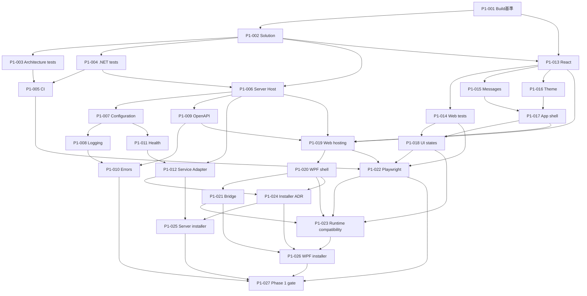

# AI Development Manager Phase 1 実装チケット一覧

版: 1.0
状態: 計画作成済み、実装未着手
基準日: 2026-08-03

## 1. Phase 1方針

- Phase 1は実行基盤に限定し、認証、LAN HTTPSオンボーディング、プロジェクト登録、走査、業務画面を実装しない。
- Phase 0で採用・条件付き採用となった技術を再比較しない。
- PoCコードを製品コードへコピーして採用扱いにせず、設計契約を満たす製品コードとして実装する。
- 一件ごとに実装、レビュー、自動テスト、必要な実機・目視確認を行う。
- UI基盤変更と業務画面実装を混在させない。
- Phase 1のServerはlocalhost限定とし、認証実装前にLAN公開しない。

## 2. チケット一覧

| 順序 | 番号 | 優先度 | タイトル | 主な依存 | 目的 | 完了条件の要約 | 状態 |
|---:|---|---|---|---|---|---|---|
| 1 | [P1-001](P1-001_TOOLCHAIN_BUILD_BASELINE.md) | A | ツールチェーン・中央ビルド基準 | P0-023 | SDK、Node、版、警告、生成物の共通基準を固定する | 固定ツールで再現ビルドでき、中央設定が一意 | 完了（製品プロジェクトはP1-002へ分離） |
| 2 | [P1-002](P1-002_PRODUCT_SOLUTION_MODULES.md) | A | 製品ソリューション・モジュール骨格 | P1-001 | 製品本体のVisual Studioソリューションと責務境界を作る | 全プロジェクトが空の状態でBuild成功し、PoCと分離 | 完了 |
| 3 | [P1-003](P1-003_ARCHITECTURE_DEPENDENCY_TESTS.md) | A | 参照方向・Windows依存境界テスト | P1-002 | 禁止参照を自動検出する | Core/ApplicationからWindows/WPFへの参照違反をCIで検出 | 完了 |
| 4 | [P1-004](P1-004_DOTNET_TEST_FOUNDATION.md) | A | .NETテスト基盤 | P1-002 | xUnitとTestServerの共通テスト構成を作る | Unit/Integrationのサンプルが固定SDKで成功 | 完了 |
| 5 | [P1-005](P1-005_CI_QUALITY_BASELINE.md) | A | CI品質ゲート基盤 | P1-003, P1-004 | Build、Test、監査、成果物検査を自動化する | クリーンCIで全ゲートが成功し警告を記録 | 完了 |
| 6 | [P1-006](P1-006_SERVER_CONSOLE_HOST.md) | B | ASP.NET CoreコンソールHost | P1-002, P1-004 | 同一Host生成元となるlocalhost Serverを作る | 起動・停止・二重起動・localhost限定を確認 | 完了 |
| 7 | [P1-007](P1-007_CONFIGURATION_OPTIONS.md) | B | 構成・Options検証基盤 | P1-006 | 設定の生成元、優先順位、検証、秘密境界を作る | 不正設定で安全に起動拒否し秘密を出力しない | 完了 |
| 8 | [P1-008](P1-008_STRUCTURED_LOGGING_TRACING.md) | B | 構造化ログ・追跡ID基盤 | P1-006, P1-007 | JSONログと要求追跡を共通化する | 全要求を追跡でき秘密情報がログへ出ない | 完了 |
| 9 | [P1-009](P1-009_API_V1_OPENAPI.md) | B | API v1・OpenAPI基盤 | P1-006 | `/api/v1`とOpenAPIを契約正本にする | 契約生成・検証が自動化され業務APIは未実装 | 完了 |
| 10 | [P1-010](P1-010_PROBLEM_DETAILS_ERROR_CONTRACT.md) | B | 共通エラー応答 | P1-008, P1-009 | Problem Detailsと利用者向け案内を統一する | 追跡ID・次の操作を含み内部例外を露出しない | 未着手 |
| 11 | [P1-011](P1-011_HEALTH_READINESS.md) | B | ヘルス・Ready状態基盤 | P1-006, P1-007 | 稼働確認と依存準備状態を分離する | live/readinessが明確で秘密情報を返さない | 未着手 |
| 12 | [P1-012](P1-012_WINDOWS_SERVICE_HOST_ADAPTER.md) | B | Windows Service Host Adapter | P1-006, P1-011 | 同一HostをService・console・manual・tray境界から利用する | Windows Service実登録と停止、Core非依存を確認 | 未着手 |
| 13 | [P1-013](P1-013_REACT_TYPESCRIPT_VITE_FOUNDATION.md) | C | React・TypeScript・Vite製品基盤 | P1-001, P1-002 | PoCから分離した共通Web UIを作る | lockfile固定、Build成功、依存監査記録 | 未着手 |
| 14 | [P1-014](P1-014_WEB_UNIT_TEST_FOUNDATION.md) | C | Web単体テスト基盤 | P1-013 | VitestとTesting Libraryを標準化する | DOM・操作・アクセシビリティのサンプルテスト成功 | 未着手 |
| 15 | [P1-015](P1-015_JAPANESE_MESSAGE_CATALOG.md) | C | 日本語文言辞書 | P1-013 | 全表示文言を辞書参照にする | 直書き検出と欠落キー検出が自動化 | 未着手 |
| 16 | [P1-016](P1-016_THEME_DESIGN_TOKENS.md) | C | Theme・デザイントークン基盤 | P1-013 | P0-021のライト／ダーク基準を実装する | Token正本が一つで両Themeの回帰確認が可能 | 未着手 |
| 17 | [P1-017](P1-017_RESPONSIVE_APP_SHELL.md) | C | レスポンシブ・アプリシェル | P1-015, P1-016 | 共通ナビ、上部バー、本文領域を作る | 1440/820/320pxで主要領域と操作を維持 | 未着手 |
| 18 | [P1-018](P1-018_COMMON_UI_STATES.md) | C | 共通状態・フィードバック部品 | P1-014, P1-017 | 保存・接続・競合等の状態表示基盤を作る | 色だけに頼らず文言・操作・ARIAを持つ | 未着手 |
| 19 | [P1-019](P1-019_SERVER_WEB_ASSET_HOSTING.md) | C | Serverによる共通Web UI配信 | P1-006, P1-009, P1-013, P1-017 | 同一Web成果物をServerから配信する | ブラウザ表示、SPAフォールバック、API分離が成功 | 未着手 |
| 20 | [P1-020](P1-020_WPF_WEBVIEW2_SHELL.md) | D | WPF WebView2シェル | P1-002, P1-019 | 共通Web UIを表示する最小WPF Clientを作る | Runtime確認、接続状態、起動終了を実機確認 | 未着手 |
| 21 | [P1-021](P1-021_WPF_BRIDGE_ALLOWLIST.md) | D | WPFブリッジ許可境界 | P1-020 | Windows固有操作だけの橋渡し契約を作る | 許可外メッセージ拒否、業務データAPIなし | 未着手 |
| 22 | [P1-022](P1-022_PLAYWRIGHT_E2E_FOUNDATION.md) | D | PlaywrightブラウザE2E基盤 | P1-005, P1-014, P1-018, P1-019 | 共通UIのブラウザ回帰を自動化する | Edge/Chromium系スモークと証拠保存が成功 | 未着手 |
| 23 | [P1-023](P1-023_UI_RUNTIME_COMPATIBILITY.md) | D | Edge・Chrome・WebView2実機互換確認 | P1-018, P1-020, P1-021, P1-022 | React条件付き採用のIME・DPI・実Runtime条件を確認する | 100～200% DPI、IME、主要操作に重大欠陥なし | 未着手 |
| 24 | [P1-024](P1-024_INSTALLER_TECHNOLOGY_ADR.md) | E | 配布・インストーラー方式ADR | P1-012, P1-020 | Server/WPF別パッケージの実装方式を固定する | 権限、更新、削除、署名経路をADR化 | 未着手 |
| 25 | [P1-025](P1-025_SERVER_INSTALLER_SERVICE_REGISTRATION.md) | E | Serverインストーラー・Service登録 | P1-005, P1-008, P1-011, P1-012, P1-024 | 管理者向けServerパッケージを作る | install/update/uninstallとService起動を実機確認 | 未着手 |
| 26 | [P1-026](P1-026_WPF_CLIENT_INSTALLER.md) | E | WPF Clientインストーラー | P1-021, P1-023, P1-024 | 標準ユーザー向けWPFパッケージを作る | install/update/uninstallとRuntime案内を確認 | 未着手 |
| 27 | [P1-027](P1-027_PHASE1_INTEGRATION_GATE.md) | A | Phase 1統合・Phase 2引継ぎゲート | P1-001～P1-026 | Phase 1成果物を監査しPhase 2開始可否を判断可能にする | 全条件、証拠、残課題、Phase 2入力が揃う | 未着手 |

## 3. 依存関係

## 4. Phase 1完了ゲート

P1-027は、P1-001～P1-026が完了し、次の証拠が揃った後に実施する。

- 固定ツールチェーンからのクリーンビルド
- .NET/Web/Architecture/E2Eテスト結果
- 依存脆弱性、ライセンス、SBOM結果
- console/Windows Service起動結果
- Edge、Chrome、WebView2、IME、DPI確認結果
- Server/WPF別パッケージのinstall/update/uninstall結果
- Phase 2へ送る認証、HTTPS、権限、プロジェクト登録の未実装境界
